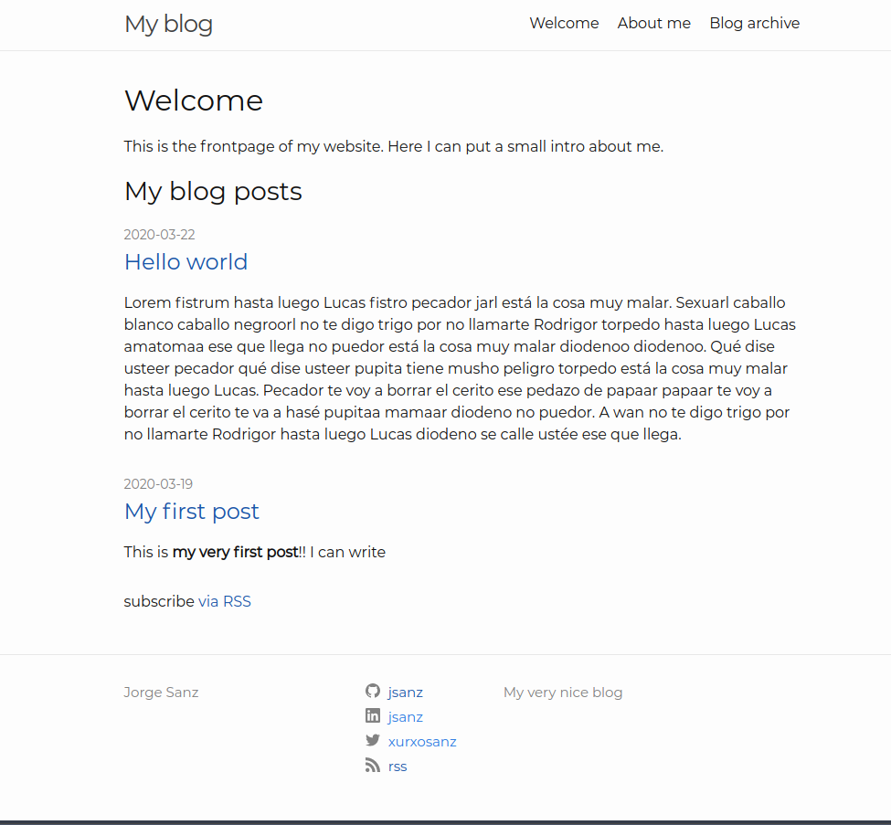

# gh-pages-minima-starter

A minimal example for running Github Pages with the [`minima` theme][minima]. This repo has what I consider the minimum pieces for a personal blog:

* Frontpage that includes your last blog posts: `_pages/frontpage.md`
* Archive for all your posts: `_pages/archive.md`
* About page: `_pages/about.md`
* Minimum 404 page: `_pages/404.md`
* Minimum metadata in the `_config.yml`
* Example CSS change inside `assets/main.scss`
* Custom footer template `_includes/footer.html`

Check out the excellent [`minima` theme][minima] documentation for further details and customization and the [official docs][gh] for more details on how Github Pages work.

## Local environment

I've included a simple `docker-compose.yml` file so you can spin up a local environment without having to install in your computer Ruby or any other library. Just install [Docker][docker] and [Docker Compose][compose], visit the repo folder and run `docker-compose up` and visit `http://localhost:8080`. 

Alternatively, if you prefer to install all the software locally please follow the [docs][install].

[minima]: https://github.com/jekyll/minima/tree/2.5-stable
[gh]: https://help.github.com/en/github/working-with-github-pages
[install]: https://help.github.com/en/github/working-with-github-pages/testing-your-github-pages-site-locally-with-jekyll
[docker]: https://docs.docker.com/get-docker/
[compose]: https://docs.docker.com/compose/install/